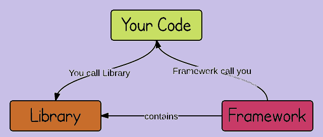
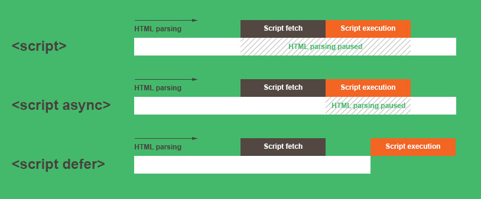

## Assignment 1 Questions:
# Chapter 1

 - Q.1 What is `Emmet`?  
 Ans: An `emmet` is a set of plugin used by text editors to quickly write the code in html , xml ,xss etc. There is a special shortcut syntax for writing the code which u have to remember which then converted to a full expanded code.

- Q.2 Difference between a `library` and `framework`?  
Ans: `Library` and `framework` are both the code written by someone else. And we use these libraries and framework to help in our project or the application we are building.
Think of Library as going to ikea for buying the furniture for our home wheers as the framework is like building a home .You have a set of blue print and the contractor is in the control for building the house.

`Technically speaking` the difference lies in the `inversion of control` while using library we have the control when we want to use that library Whereas when you use a framework, the framework is in charge of the flow. It provides some places for you to plug in your code, but it calls the code you plugged in as needed.

- Q.3 What is `CDN` ? Why do we use it?  
Ans: `CDN` is a `content delivery network` which is a group of geographically and interconnected servers. They provide `cached` internet content from a network location closest to a user to speed up its delivery.

Lets understand why do we use it through an example:
Imagine there is a website hosted on a webserver in Bengaluru and we want to visit this website in Delhi so at the first time we visit the website it get requested from the original server but at the same time it will also send a copy of the responsed website to a `CDN point of presence(POP)` that geographically closest to website visitor. 
Now the CDN Pop stores its copy as cached. 
Whenever any person in this area will request this website it will be delivered by the caching server. 

- Q.4 Why is `React` known as `React`?  
Ans: React is known as react because of its ability to `react to changes in data`. It quickly load the dom manipulation without reloading the whole content .It is `fast` and `scalable`. It was developed by `facebook` and it is an `open source library`.

- Q.5 What is `crossorigin in script tag`?  
Ans: The `crossorigin` attribute set the mode of request to a HTTP CORS Request. 
The purpose of using crossorigin is to share the resources from one domain to another domain.Basically it is used to handle the CORS request.They check whether it is safe to allow sharing for sharing the resource from one domain to another.

- Q.6 What is difference between `React and ReactDOM`?  
Ans. `React` is a javascript library designed to make better user interfaces.  
`ReactDOM` is another javascript library which glues react to `DOM Manipulation`.Means it allows react to interact with DOM.

- Q.7 What is difference between `react.development.js` and `react.production.js` files via CDN?  
Ans. `react.development.js` is used when you are developing the project it is used in the development phase which includes features like detailed error messages and debugging tools. 
Whereas `react.production.js` is used when you are deploying the project and it available on internet. It is used because it is fast and it will take less time to load.

- Q.8 What is `async and defer`?  
Ans.`Async` In this the scipt are downloaded parallel while the html is parsing and as soon the script get downloaded it will start executing. 
`Defer` In this the script are downloaded parallel while the html is loading and until the html is loaded completely the script waits for it and after that the scripts are executed.

 

## Assignment Done!
